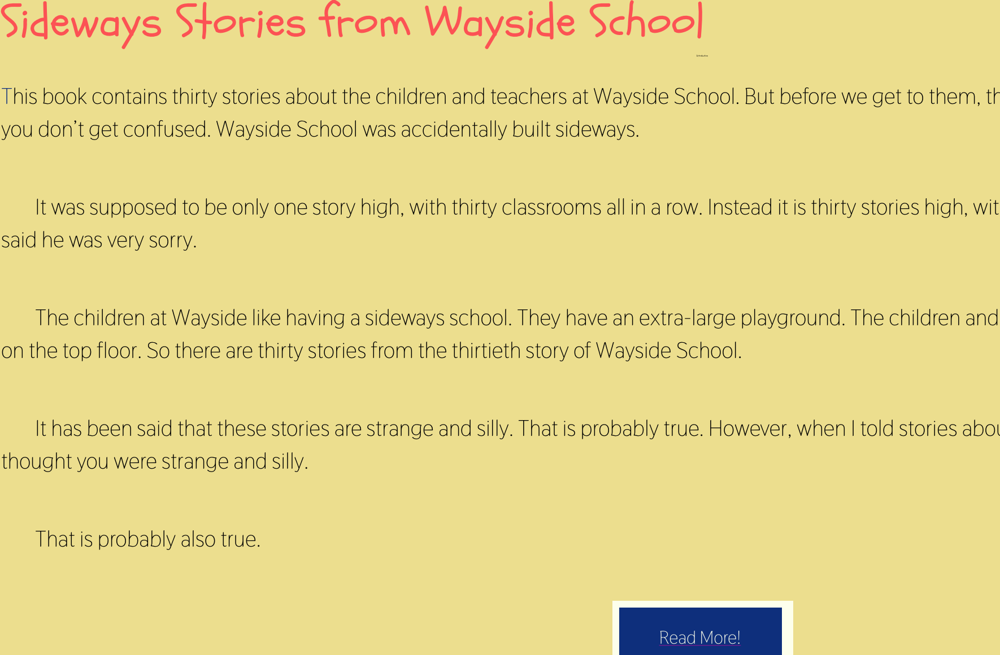

# Typography

1. I chose a handwriting font that was actually called schoolbell because I wanted something that made me (and other people!) think of the third grade or whatever grade the wayside school kids are in. Then I chose a simple sans serif for the actual text of the story for something clean looking and easy to read.

2. A system font is a file stored directly on your computer that makes a font available in most applications on your computer. It has to be downloaded and installed before it can be used. A web-font is a font that is stored in a server and can be displayed on a web page through communication with the file over the internet. It's not always available to every person who looks at the page due to a browser being old or being unable to download the file. That's where web-safe fonts come in, they're general, universal fonts that basically every computer has so it's easy for them to display everywhere no matter what. Fallback fonts can help with the issue of web vs web safe fonts. A fallback font would replace a less common font with one that is similar and more universal so the look of the page isn't completely changed if a font is unavailable.

3. This work cycle was easier for me than the last one but I did a LOT of looking at the examples provided and the examples on some of my classmates pages for guidance on how to structure my styles page. I'm finding it difficult to adjust to using two different pages in two different formats to dictate how my page will look and my style page wound up being way longer than I expected it to be for what really is quite a simple page.
Applying the fonts themselves was such a small part of the project and that part I had almost no trouble with at all. It's just an adjustment to using stylesheets and thinking about my page in terms of what styles I need before I start building elements in html. 

