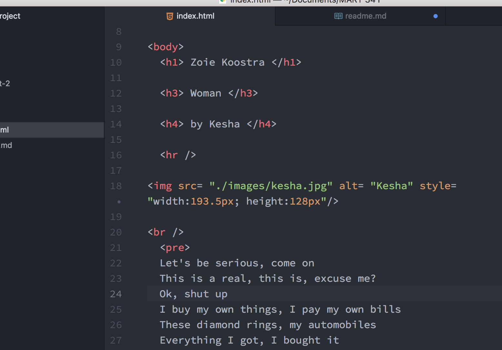

# Readme Project 1

### Browsers
The brower I use to access the internet (and to check things I'm developing!) is chrome. Chrome is the best or even if it isn't, I'm just so used to it now that I want to stick with it. It also has a lot of useful plugins etc that I use. A browser is what makes the code that makes up webpages and the internet look like something a person who doesn't know code or doesn't just want to interact with code can understand and even find visually helpful or pleasing. A browser reads the html or javascript or whatever code tells your website to look or act a certain way and builds that visually and helps you perform those tasks.

### Wayback Machine
The thing that surprised me the most about all the websites I visited (I looked at the ones listed and also the website for the movie Space Jam lol) is just how... ugly everything is. Like the way there was centered text all over the place and the same neutral type-writer style font that shows up when you don't specify what font to use. Stuff that seems like it would be really simple and easy to do but they weren't doing it, which tells me maybe they weren't thinking about it. I think the "science" of design has taken off a lot in recent years too.

### Work cycle
-So this cycle I built a really simple webpage! Whoo! I've done it before in elementary coding and a little bit in creative coding so it wasn't too hard. I haven't coded all summer though so I did have to look up a couple things. For example, when I put in my picture it was huge but I had to look up the code for resizing it.

-My biggest problem actually turned out to not be a problem haha. Usually when I code I push directly from atom and pushing from github desktop takes a couple more minutes. So at first when I finished and I couldn't see my site but also couldn't see what could be wrong I freaked out for a minute. All I had to do to fix it was literally get a glass of juice and come back and by then it had updated and everything worked haha.

-I'm just pumped to get back into coding and go more in depth on visuals which is something my computer science class definitely did not touch on haha. So far I've just been brushing up on my skills and it feels good to know that I learned enough last year to have this just be a refresher.

-No issues, didn't post. Didn't answer any posts, sorry. I want to make more of a point in doing so though. I feel pretty confident right now so hopefully I can help others?

### Screenshot

